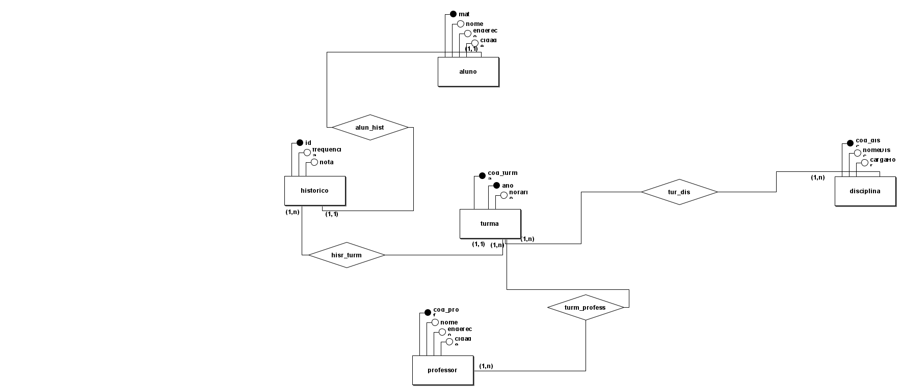
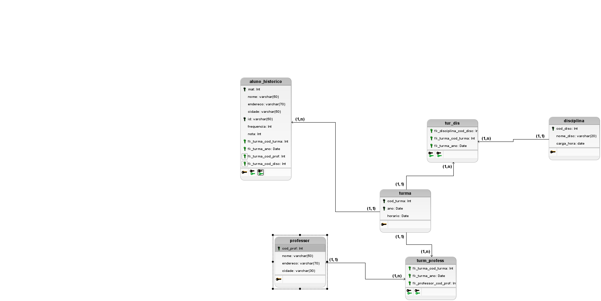

# Avaliação de Banco de Dados
## Descrição do trabalho

[PDF de Instrução utlizada para a efetuação da prova, acesse aqui.](AtividadeAvaliativa.pdf) 

# Mapa Conceitual:

# Mapa Lógico:

<h2>Tabela <i>Aluno_Historico</i></h2>
A tabela <iAluno_Historico</i> é a tabela responsavel por guardar os dados do aluno e seus historicos diretamente relacionados
Nela possuímos os atributos/colunas:
<ul>
  <li>mat: matricula e chave primária da tabela</li>
  <li>id: indentificador do historico do aluno e chave primaria</li>
  <li>nome: nome do aluno.</li>
  <li>endereço: endereço do aluno ,aonde o aluno mora</li>
  <li>cidade: cidade onde o aluno esta</li>
  <li>frequrncia</li>
  <li>cidade: cidade onde o aluno esta</li>
  <li>cidade: cidade onde o aluno esta</li>
  <li>fk_usuario_cod_usuario: chave estrangeira que faz referência a tabela <i>usuario</i></li>
</ul>

